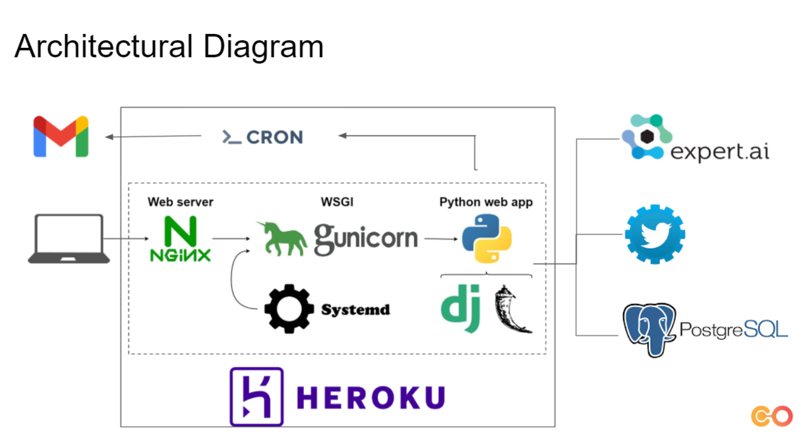

# SocialCare

Social Care is a Python Based plug and play sentiment analysis project.
# Use Case
1. Social Care can be used by HRs to analyze sentiments of their employees based on their social media accounts.
2. It can also be used to check on Hate Speeches in twitter.
3. Among Social Groups, it can help check sentiment pattern of a member and check if they need attention.

# Visualizations 

# Architectural Diagram

# Data Flow Diagram

# Process

# Potential use cases

1. Ed-Tech - Since 2020, the trend of online classes is increasing. With Google Text to Speech API, the lectures can be 
given as text input to Social Care to check for the polarity and key words used. This can improve the assertiveness of the lectures.
   
2.Government Agencies - Agencies such as Election Commission can check the polarity and hate speech using Social Care.

3. Professional - The assertiveness of online content can be checked and improved. Eg. Linkedin Profile, website content etc.

4. Students - UPSC students can check assertiveness in their answer writing skills. SOPs for applying for foreign universities can be checked
and improved.

References
1. Using Twitter API - https://towardsdatascience.com/how-to-scrape-more-information-from-tweets-on-twitter-44fd540b8a1f
2. Postgres with Python - https://www.postgresqltutorial.com/postgresql-python/
3. Flask - https://dev.to/zmbailey/the-flow-of-flask-a-brief-explanation-of-flask-data-flow-h6a
4. Postman - https://www.freecodecamp.org/news/learn-how-to-use-postman-to-test-apis/ 
5. Heroku - https://www.youtube.com/watch?v=Li0Abz-KT78
6. Sending Email with python - https://www.youtube.com/watch?v=JRCJ6RtE3xU
7. Cron-job to automate flow - https://dkhundley.medium.com/data-science-quick-tip-002-running-a-cronjob-from-within-a-flask-api-b77b5d94add5
8. 2-D Heatmap - # https://matplotlib.org/stable/gallery/images_contours_and_fields/image_annotated_heatmap.html