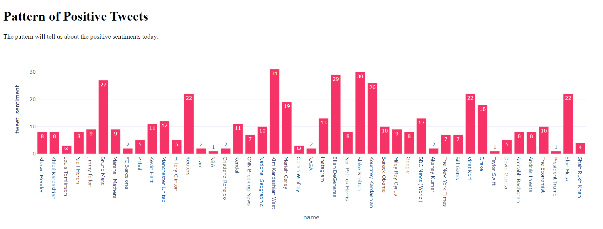
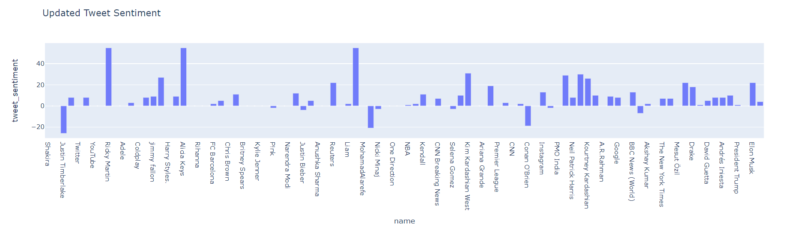
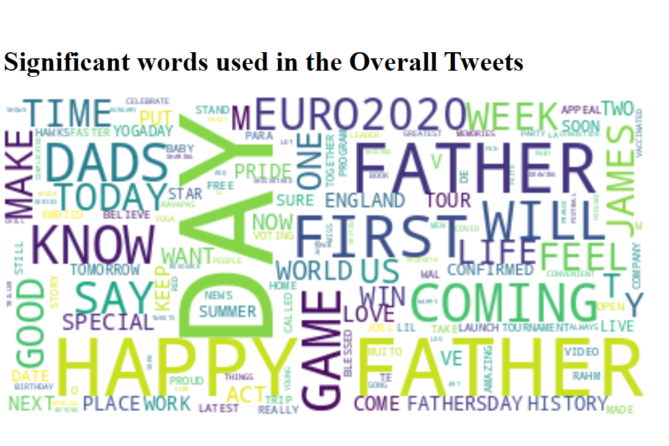
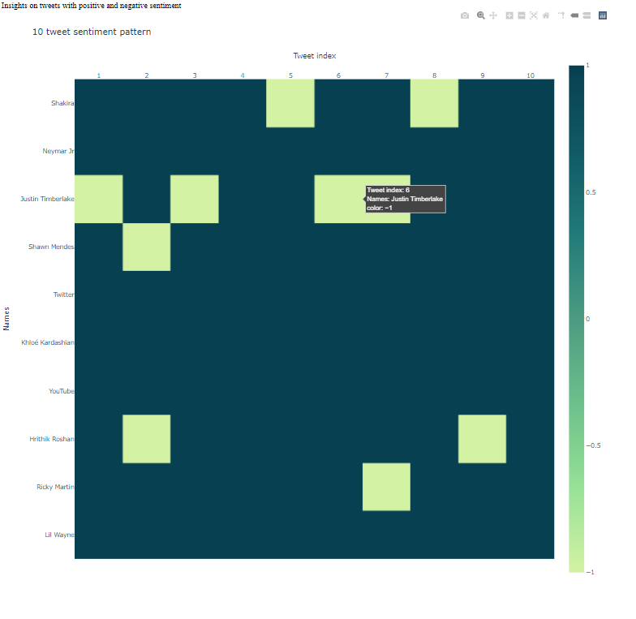
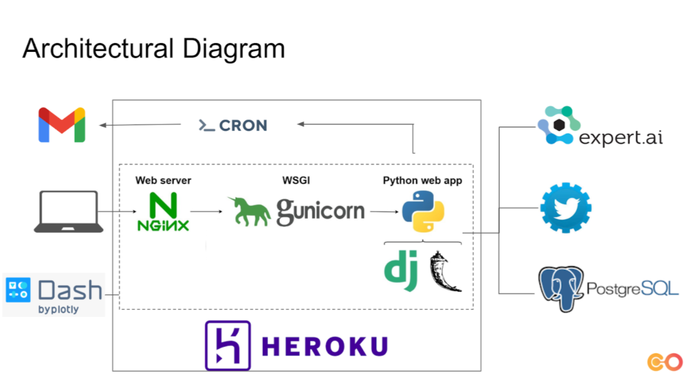
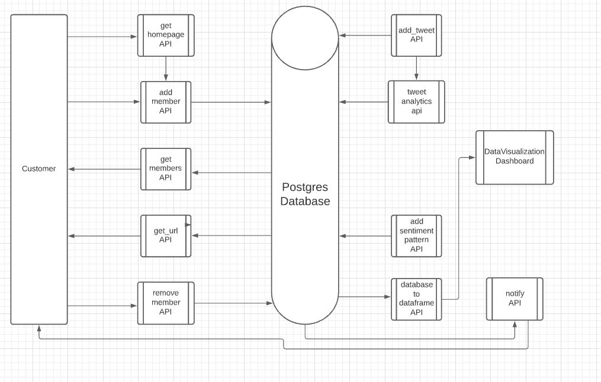

# Motivation for  SocialCare

The World has become a large scale work from home experiment since covid-19 outbreak in 2020.With this,many of us are able to enjoy 
company of their families. However, there are also many facing emotional challanges, at times leading to mental breakdown or more.
A work place provides one with communication, processes and culture related to work. Retaining it working from home can be really difficult. 
Therefore,a step towards improving attention towards employees to support them,not when they ask or its late, but when a pattern of negativie emotions
emerges can be useful. Prevention is better than cure.

# What Social Care is about?
SocialCare analyzing linguistic markers in social media posts of employees.The insights of this analysis can be benificial to 
understand hidden sentiment in the post.With this analysis on last few posts of the user,hidden negative sentiments if any,can be checked.
With use of Database, this application can be scaled to attend to even 1000s of employees or members.

# How we do it?
Lets understand this with the diagrams below.

#What impact it can have?
It is developed as a support system of communication between HRs and Employees. It can b connect to the HR database easily using a connector.
Improved understanding of Employee's problem can help better communication, rapport and efficiencies when Working from Home.

# Other Use Case

1. It can also be used to check on Hate Speeches in twitter.
2. Among Social Groups, it can help check sentiment pattern of a member and check if they need attention.
3. It can be used for review analysis in real time.

# Visualizations 

# Architectural Diagram

# Data Flow Diagram

# Process

# Potential use cases

1. Ed-Tech - Since 2020, the trend of online classes is increasing. With Google Text to Speech API, the lectures can be 
given as text input to Social Care to check for the polarity and key words used. This can improve the assertiveness of the lectures.
   
2.Government Agencies - Agencies such as Election Commission can check the polarity and hate speech using Social Care.

3. Professional - The assertiveness of online content can be checked and improved. Eg. Linkedin Profile, website content etc.

4. Students - UPSC students can check assertiveness in their answer writing skills. SOPs for applying for foreign universities can be checked
and improved.

References
1. Using Twitter API - https://towardsdatascience.com/how-to-scrape-more-information-from-tweets-on-twitter-44fd540b8a1f
2. Postgres with Python - https://www.postgresqltutorial.com/postgresql-python/
3. Flask - https://dev.to/zmbailey/the-flow-of-flask-a-brief-explanation-of-flask-data-flow-h6a
4. Postman - https://www.freecodecamp.org/news/learn-how-to-use-postman-to-test-apis/ 
5. Heroku - https://www.youtube.com/watch?v=Li0Abz-KT78
6. Sending Email with python - https://www.youtube.com/watch?v=JRCJ6RtE3xU
7. Cron-job to automate flow - https://dkhundley.medium.com/data-science-quick-tip-002-running-a-cronjob-from-within-a-flask-api-b77b5d94add5
8. 2-D Heatmap - # https://matplotlib.org/stable/gallery/images_contours_and_fields/image_annotated_heatmap.html
9. https://towardsdatascience.com/sentiment-analysis-concept-analysis-and-applications-6c94d6f58c17
10.Plotly- https://community.plotly.com/t/count-repeated-names-and-add-the-number-to-the-pie-graph/33710/3
11.Plotly- https://www.youtube.com/watch?v=_b2KXL0wHQg
12. Plotly Bar Chart - https://www.youtube.com/watch?v=N1GwQNatOwo&list=PLh3I780jNsiTXlWYiNWjq2rBgg3UsL1Ub   
13.Dashboard - https://stackoverflow.com/questions/63459424/how-to-add-multiple-graphs-to-dash-app-on-a-single-browser-page
14.Dashboard - https://stackoverflow.com/questions/66277766/plotly-dash-button-callback-function
15. Detailed blog on Dash - https://towardsdatascience.com/how-to-build-a-complex-reporting-dashboard-using-dash-and-plotl-4f4257c18a7f
16. Color Scales in Plotly- https://plotly.com/python/builtin-colorscales/
17. Deploying on Heroku - https://www.youtube.com/watch?v=b-M2KQ6_bM4
18. WordCloud - https://www.kaggle.com/jagangupta/wordcloud-of-tweets
19. Dash in Flask - https://github.com/okomarov/dash_on_flask

20.Front-end- Adding background images - https://www.youtube.com/watch?v=33IinMVJf-M

###### Attributions
1. Photo by <a href="https://unsplash.com/@jupp?utm_source=unsplash&utm_medium=referral&utm_content=creditCopyText">Jonathan Kemper</a> on <a href="https://unsplash.com/s/photos/work-from-home?utm_source=unsplash&utm_medium=referral&utm_content=creditCopyText">Unsplash</a>
2. Photo by <a href="https://unsplash.com/@austindistel?utm_source=unsplash&utm_medium=referral&utm_content=creditCopyText">Austin Distel</a> on <a href="https://unsplash.com/s/photos/organization?utm_source=unsplash&utm_medium=referral&utm_content=creditCopyText">Unsplash</a>
  
